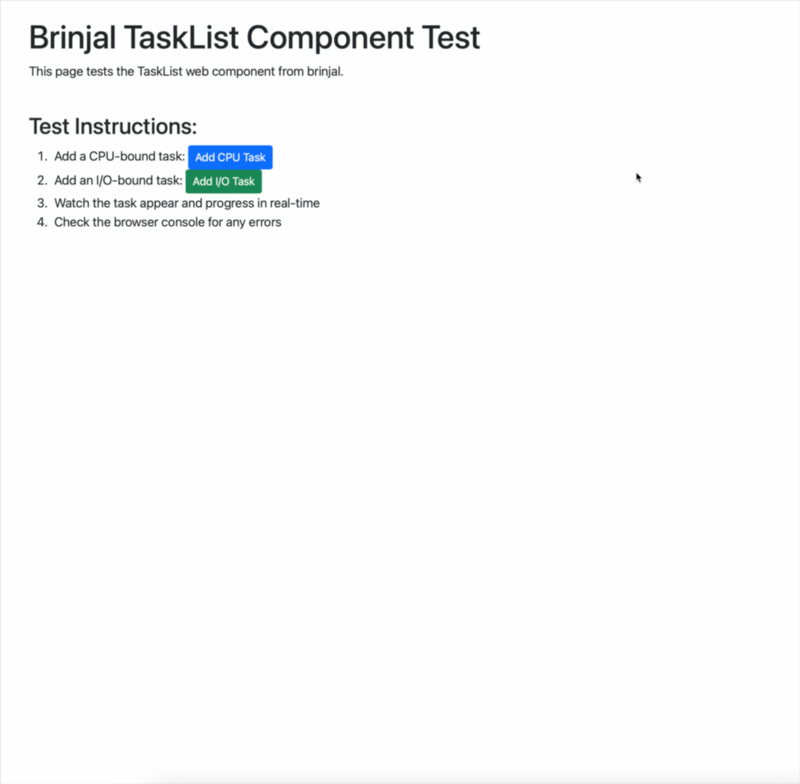

# Brinjal



A generic, reusable task management system built with FastAPI and asyncio. Brinjal provides a flexible foundation for building task-based applications with real-time progress updates via Server-Sent Events (SSE).

## Features

- **Generic Task Management**: Base `Task` class that can be extended for any type of task
- **Real-time Updates**: Server-Sent Events (SSE) for live progress updates
- **Asynchronous Execution**: Built on asyncio for high-performance task processing
- **Flexible Integration**: No hardcoded prefixes - easily integrated into any FastAPI application
- **Web Components**: Reusable frontend components for displaying tasks
- **Progress Tracking**: Built-in progress monitoring and status updates

## Quick Start

### Installation

```bash
pip install brinjal
```

### Running the Development Server

```bash
# Clone the repository
git clone https://github.com/sg-s/brinjal.git
cd brinjal

# Install dependencies
uv sync

# Run the development server
make dev
```

The server will start at `http://localhost:8000`.

### End-to-End Testing

1. **Start the server**: `make dev`
2. **Add a task**: `curl -X POST http://localhost:8000/api/tasks/example_task`
3. **View the test page**: Open `http://localhost:8000/api/tasks/test` in your browser
4. **Watch real-time updates**: The task will appear and progress in real-time

## Usage in Other Projects

### Basic Integration

```python
from fastapi import FastAPI
from brinjal.api.router import router as brinjal_router

app = FastAPI()

# Include brinjal with your desired prefix
app.include_router(brinjal_router, prefix="/api/tasks")
```

### Advanced Integration with Custom Endpoints

```python
from fastapi import APIRouter
from brinjal.api.router import router as brinjal_router
from brinjal.manager import task_manager

# Create your main router with the desired prefix
router = APIRouter(prefix="/api/tasks")

# Include all of brinjal's functionality
router.include_router(brinjal_router)

# Add your custom endpoints
@router.post("/custom_task")
async def custom_task():
    # Your custom logic here
    pass

# Include in your main app
app.include_router(router)
```

### Frontend Integration

```html
<!-- Load the TaskList component from your brinjal endpoint -->
<script src="/api/tasks/static/TaskList.js"></script>

<!-- Use the component -->
<task-list base_url="https://yourdomain.com"></task-list>
```

## API Reference

### Core Endpoints

- `GET /api/tasks/queue` - Get all tasks
- `POST /api/tasks/example_task` - Create an example task
- `GET /api/tasks/{task_id}/stream` - Stream task updates via SSE
- `GET /api/tasks/static/{file}` - Static files (TaskList.js, etc.)

### Data Models

- **TaskUpdate**: Generic task update model with `task_id`, `task_type`, `status`, `progress`, `img`, `heading`, `body`

## Development

### Running Tests

```bash
# Run all tests
make test

# Run specific test suites
make test-task-manager
make test-example-task

# Run with coverage
make test-cov
```

### Building Documentation

```bash
make docs
```

### Building the Package

```bash
make build
```

## Architecture

Brinjal is designed with separation of concerns in mind:

- **`Task`**: Base class for all tasks with common functionality
- **`TaskManager`**: Manages task execution and SSE event generation
- **`ExampleTask`**: Concrete implementation demonstrating task patterns
- **Router**: FastAPI router with generic endpoints (no hardcoded prefixes)
- **Static Files**: Web components and assets for frontend integration

## Contributing

1. Fork the repository
2. Create a feature branch
3. Make your changes
4. Add tests for new functionality
5. Ensure all tests pass
6. Submit a pull request

## License

MIT License - see [LICENSE.txt](LICENSE.txt) for details.
